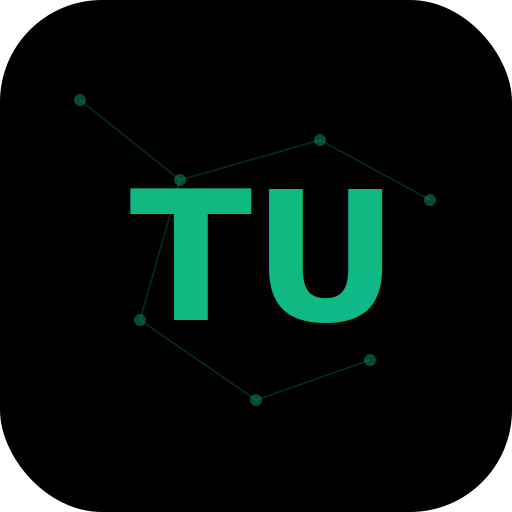

<div align="center">
  <a href="https://github.com/liuyaaixxa/teniulink-node-client">
    
  </a>
  <h1>Teniulink Node</h1>
  <p><strong>家庭智能网关节点客户端</strong></p>
  <p>将本地 AI 服务共享到 <a href="https://teniuapi.online">Teniu 云</a>，让全球用户都能使用</p>
  <p>
    <a href="https://github.com/liuyaaixxa/teniulink-node-client/releases">下载</a> ·
    <a href="https://teniuapi.online">Teniu 云</a> ·
    <a href="#-快速开始">快速开始</a> ·
    <a href="#-开发">开发</a>
  </p>
</div>

---

## 📖 简介

Teniulink Node 是 [Teniu 云](https://teniuapi.online) 分布式 AI 服务网络的节点客户端。它将你本地的 AI 服务（如 Ollama、LM Studio 等）通过智能网关安全地共享到云端，让其他用户也能使用你的算力资源。

同时，Teniulink Node 也是一个功能完整的跨平台 AI 助手桌面客户端，支持 Windows、macOS 和 Linux。

**本项目 Fork 自 [Cherry Studio](https://github.com/CherryHQ/cherry-studio)，感谢原作者的开源贡献。**

## 🔄 工作原理

```
┌─────────────────────────────────────────────────────────────┐
│                      Teniu 云 (teniuapi.online)              │
│              统一 LLM 网关 · OpenAI/Claude/Gemini 兼容        │
└──────────────┬──────────────────────────┬───────────────────┘
               │                          │
         API 调用                    服务注册
               │                          │
      ┌────────▼────────┐       ┌─────────▼─────────┐
      │    消费端用户     │       │   Teniulink Node   │
      │  (API / Web UI)  │       │   (家庭智能网关)     │
      └─────────────────┘       └─────────┬─────────┘
                                          │
                                    本地 AI 服务
                                          │
                                ┌─────────▼─────────┐
                                │  Ollama (:11434)   │
                                │  LM Studio         │
                                │  其他 LLM 服务      │
                                └───────────────────┘
```

## 🚀 快速开始

### 1. 注册 Teniu 云账号

前往 [teniuapi.online](https://teniuapi.online) 注册账号。支持以下登录方式：

- GitHub 登录
- Discord 登录
- 邮箱注册
- Openfort 钱包登录 (Web3)

### 2. 下载安装 Teniulink Node

从 [Releases](https://github.com/liuyaaixxa/teniulink-node-client/releases) 页面下载对应平台的安装包：

| 平台 | 格式 |
|------|------|
| macOS | DMG, ZIP (arm64 / x64) |
| Windows | NSIS 安装包, 便携版 (x64 / arm64) |
| Linux | AppImage, Deb, RPM (x64 / arm64) |

### 3. 登录并加入节点

1. 打开 Teniulink Node，通过 **浏览器登录** 或 **Access Token** 登录
2. 进入 **设置 → Teniu 云**，配置访问密钥
3. 启动智能网关，本地 AI 服务将自动共享到云端

### 4. 其他用户使用你的服务

其他用户可通过 Teniu 云 API 调用你节点提供的 AI 服务，API 兼容 OpenAI 格式。

## 🌟 核心特性

### 智能网关节点

- 🌐 **云端连接**：一键加入 Teniu 云分布式 AI 服务网络
- 📡 **服务共享**：将本地 Ollama 等 AI 服务安全共享到云端
- 🔐 **安全隧道**：基于 Octelium 框架的加密通信
- 📊 **系统监控**：CPU、GPU、内存、磁盘配置实时展示

### 多 LLM 提供商支持

- ☁️ **云端服务**：OpenAI、Anthropic、Google Gemini、Azure 等 20+ 提供商
- 💻 **本地模型**：Ollama、LM Studio、HuggingFace 推理服务
- 🔗 **API 兼容**：支持 OpenAI API 规范的任意服务

### AI 对话功能

- 💬 **多模型对话**：同时与多个 AI 模型交流
- 📚 **智能助手**：300+ 预置 AI 助手
- 🎨 **主题定制**：亮色/暗色主题，透明窗口
- 📝 **Markdown 渲染**：完整支持代码高亮、Mermaid 图表
- 🔧 **MCP 支持**：Model Context Protocol 服务器集成

## 🛠 技术栈

| 类别 | 技术 |
|------|------|
| 运行时 | Electron 40, Node.js ≥24 |
| 前端 | React 19, Redux Toolkit, Ant Design 5 |
| 样式 | styled-components, TailwindCSS v4 |
| 富文本 | TipTap 3.2 (Yjs 协作) |
| AI SDK | Vercel AI SDK v5 |
| 数据库 | Dexie (IndexedDB), Drizzle ORM (SQLite) |
| 构建 | electron-vite 5, rolldown-vite 7 |

## 💻 开发

### 环境要求

- Node.js ≥22
- pnpm 10.27.0+

### 开发命令

```bash
# 安装依赖
pnpm install

# 启动开发模式
pnpm dev

# 代码检查
pnpm lint

# 运行测试
pnpm test

# 构建
pnpm build
```

### 项目结构

```
src/
├── main/          # Electron 主进程 (Node.js)
├── renderer/      # React 渲染进程
└── preload/       # IPC 桥接层

packages/
├── aiCore/        # AI SDK 抽象层
├── shared/        # 跨进程类型定义
└── mcp-trace/     # OpenTelemetry 追踪
```

## 📄 许可证

本项目基于 [AGPL-3.0](LICENSE) 许可证开源。

## 🙏 致谢

本项目 Fork 自 [Cherry Studio](https://github.com/CherryHQ/cherry-studio)，感谢 Cherry Studio 团队的开源贡献。

---

<div align="center">
  <p>Made with ❤️ by Teniulink Team</p>
</div>
